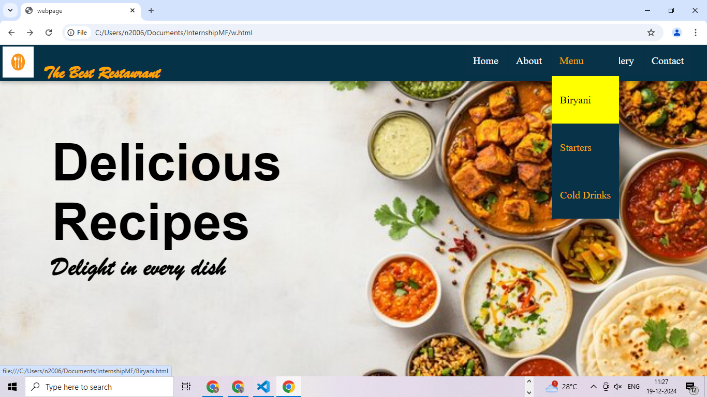
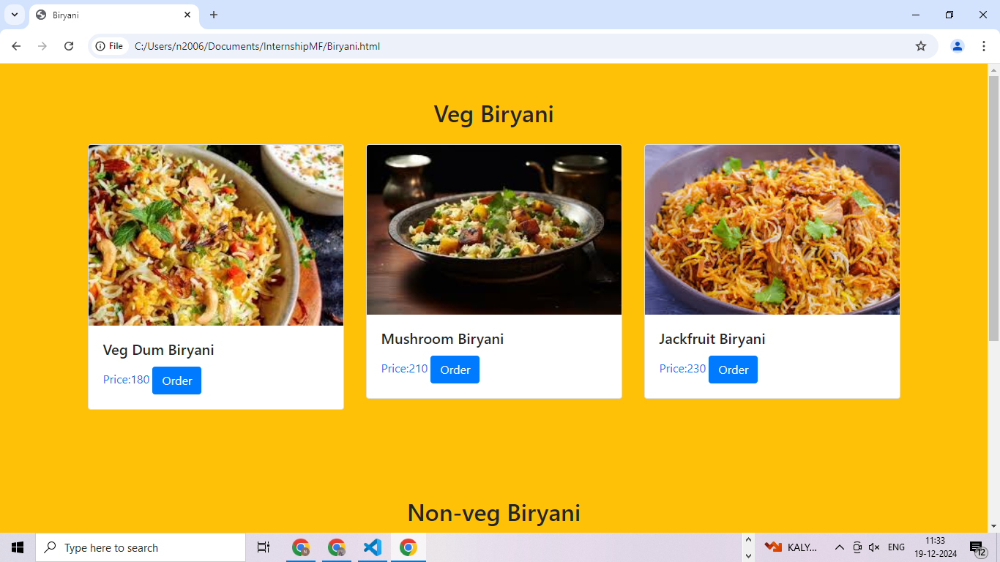

# Restaurant Website  

## Description  
This is a modern and responsive restaurant website designed to showcase the restaurant's offerings, provide location details, and enable online reservations or orders. The website is user-friendly, visually appealing, and optimized for all devices.  

## Features  
- **Home Page**: 
  
- **Menu**: Categorized sections (e.g.,Main Course,Biryani,starters, Cold drinks) with descriptions and pricing.
      
- **About Us**: Details about the restaurant's history, vision, and specialties.  
- **Gallery** 
- **Contact**: A contact form, phone numbers, email, and social media links.  

## Technologies Used  
- **Frontend**:  
  - HTML5  
  - CSS 

